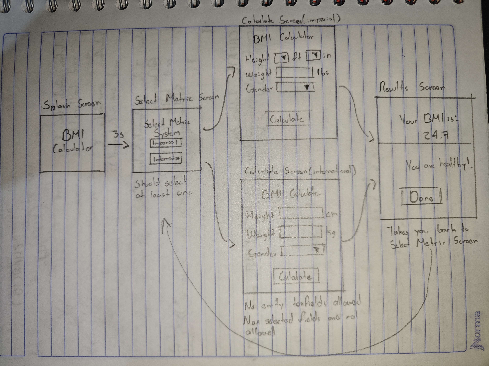
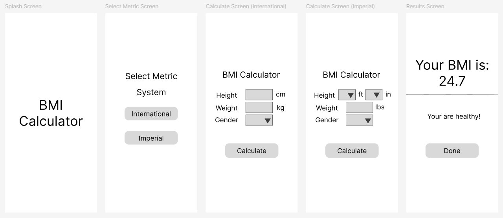
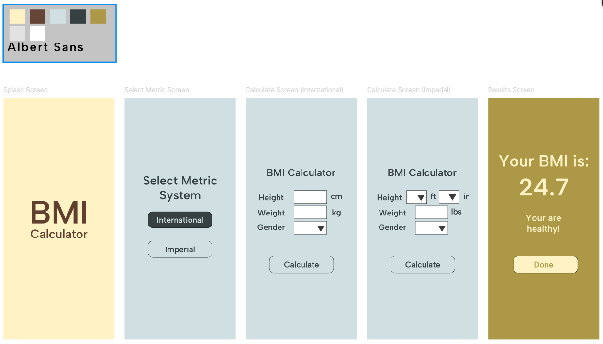

# Final Project  

### Customer Request

*"I want an app that tells me my Body Mass Index. I should be able to input my height, weight, and gender and the app should calculate and show my BMI and tell me if I'm overweight or underweight."*

---

## Behavior-Driven Design

### User Stories

- As a user, I should be able to input my height, weight, and gender, so that the app can calculate and show my current BMI.

- As a user, I should be able to input my height, weight, and gender, so that the app can calculate my BMI and show my current health status (overweight, underweight, or healthy).

- As a user, I should be able to choose between metric systems (international or imperial), so that I can input my weight and height using the corresponding units. 

### OPTIONAL
- As an underweight user, I should be able to input my height, weight, and gender, so that I can see my current BMI and the amount of kg/lbs I need to gain to get healthy.

- As an overweight user, I should be able to input my height, weight, and gender, so that I can see my current BMI and the amount of kg/lbs I need to lose to get healthy.

### Validation Sketch

### Lo-Fi Prototype

### Hi-Fi 

---

## Test-Driven Development

### Happy Paths

- **GIVEN** I am on the Select Metric Screen, **WHEN** I tap “Imperial”, AND I select 5ft 8in for my height, I input 160lbs for my weight, AND I select male for my gender, AND I tap “Calculate”, **THEN** I should see “Your BMI is 24.3 – You are Healthy!”.

- **GIVEN** I am on the Select Metric Screen, **WHEN** I tap “International”, AND I input 173cm for my height, 72kg for my weight, AND I select male for my gender, AND I tap “Calculate”, **THEN** I should see “Your BMI is 24.1 – You are Healthy!”.

- **GIVEN** I am on the Select Metric Screen, **WHEN** I tap “Imperial”, AND I select 5ft 8in for my height, I input 190lbs for my weight, AND I select male for my gender, AND I tap “Calculate”, **THEN** I should see “Your BMI is 28.9 – You are Overweight!”.

- **GIVEN** I am on the Select Metric Screen, **WHEN** I tap “International”, AND I input 180cm for my height, 55kg for my weight, AND I select female for my gender, AND I tap “Calculate”, **THEN** I should see “Your BMI is 17 – You are Underweight!”.

- **GIVEN** I am on the Select Metric Screen, **WHEN** I tap “Imperial”, AND I select 5ft 8in for my height, I input 230lbs for my weight, AND I select male for my gender, AND I tap “Calculate”, **THEN** I should see “Your BMI is 35 – You are Obese!”.

- **GIVEN** I have completed my inputs (metric selected, weight, height, AND gender entered) AND I am on the Results Screen **WHEN** I tap “Done” **THEN** I should be taken back to the Select Metric Screen. 

- **GIVEN** I have completed my inputs (metric selected, weight, height, AND gender entered)AND I am on the Results Screen, **WHEN** I tap “backButton”, **THEN** I should be taken back to the Calculate Screen.

- **GIVEN** I have selected a metric, AND I am on the Calculate Screen, **WHEN** I tap “backButton”, **THEN** I should be taken back to the Select Metric Screen.

### Sad Paths

- **GIVEN** I am on the Select Metric Screen, **WHEN** I don’t tap on ‘Imperial’ or ‘International’, **THEN** I should still be on the Select Metric Screen.

- **GIVEN** I have selected International for the metric system, AND I am on the Calculate Screen, **WHEN** I leave any of the required fields (weight, height, or gender) empty, AND I tap on “Calculate”, **THEN** I should still be on the same page, AND I should see an error message ‘Please fill in all fields.’ 

- **GIVEN** I have selected Imperial for the metric system, AND I am on the Calculate Screen, **WHEN** I leave any of the required fields (weight, height, or gender) empty, AND I tap on “Calculate”, **THEN** I should still be on the same page, AND I should see an error message ‘Please fill in all fields.' 

- **GIVEN** I have selected International for the metric system, AND I am on the Calculate Screen, **WHEN** I input my weight using any non-numeric characters (ex: @, #, *, -), AND I tap on “Calculate”, **THEN** I should still be on the same page, AND I should see an error message ‘Please fill in all fields.’ 

- **GIVEN** I have selected Imperial for the metric system, AND I am on the Calculate Screen, **WHEN** I input my weight using any non-numeric characters (ex: @, #, *, -), AND I tap on “Calculate”, **THEN** I should still be on the same page, AND I should see an error message ‘Please fill in all fields.’ 

